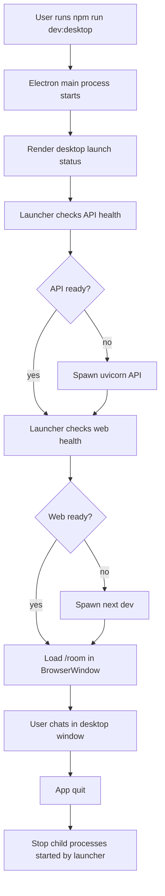

# KumikoRoom Desktop App Design

## Goal

Build KumikoRoom into a progressively more complete desktop app in three stages:

1. Development desktop app: one command opens Electron and automatically manages the local API and web app.
2. Installable experience: package the desktop app for Windows with icons, app metadata, user-data paths, and a clean launch flow.
3. More independent desktop app: reduce development-environment assumptions and add production-style desktop behavior.

Stage 1 is the immediate implementation target. Stages 2 and 3 guide the shape of the code so the first pass does not paint the project into a corner.

## Current State

The current `apps/desktop` package is a thin Electron shell:

- `apps/desktop/src/main.ts` creates a `BrowserWindow`, installs a small menu, and loads `http://127.0.0.1:3000/room`.
- `apps/desktop/src/config.ts` stores the default web URL and window options.
- `apps/desktop/tests/config.test.ts` covers URL configuration and the window title.
- Root scripts expose `npm run dev:web` and `npm run dev:desktop`, but no single script starts API, web, and desktop together.

Known desktop gaps:

- The user must manually start the FastAPI server and Next.js server.
- The Electron window exposes localhost failure behavior when those services are down.
- The fallback HTML and menu labels contain encoding-corrupted Chinese text.
- The desktop package has no service lifecycle layer, logs, status model, packaging, icon, or app data policy.

## Product Principles

- The desktop app should feel like the main entry point for local use.
- Localhost and terminal commands should move out of the ordinary user path.
- Developer diagnostics should remain available when launch fails.
- Stage 1 should stay lightweight and reliable: it can require installed Node and Python tooling.
- Stage 2 can introduce app packaging.
- Stage 3 can tackle bundled runtimes, auto ports, tray behavior, and richer lifecycle management.

## Stage 1: Development Desktop App

### User Experience

The user runs one command from the repository root:

```powershell
npm run dev:desktop
```

The desktop app then:

1. Opens an Electron window quickly.
2. Shows a launch status page using the Warm Rose Fog visual direction while services start.
3. Starts or reuses the local API on port `8000`.
4. Starts or reuses the local Next.js web app on port `3000`.
5. Waits for both services to respond.
6. Loads `/room` inside Electron.
7. Shuts down child processes that it started when the app quits.

If a service fails, the Electron window remains useful:

- It shows which service failed.
- It offers a retry action.
- It offers a copyable log excerpt.
- It avoids raw stack traces as the primary message.

### Scope

In scope for Stage 1:

- Desktop launcher service orchestration.
- Port checks for API and web app.
- Process spawning for `uvicorn` and `next dev`.
- Readiness polling with timeouts.
- A small typed launch state model.
- A built-in desktop launch/status page.
- Clean process shutdown on app exit.
- Encoding-safe menu and fallback/status text.
- Tests for configuration, command construction, status transitions, and failure handling.
- README instructions for the one-command desktop flow.

Out of scope for Stage 1:

- Windows installer generation.
- Bundling Python or Node runtimes.
- Automatic updates.
- Tray app behavior.
- Native OS notifications.
- Running without a local development checkout.
- Replacing the existing web UI with native UI.

### Architecture

Stage 1 keeps Electron as the desktop host and keeps the Next.js app as the UI surface. The new layer is a desktop launcher inside `apps/desktop` that owns service orchestration before the window navigates to `/room`.

Proposed desktop modules:

- `apps/desktop/src/config.ts`
  - Owns default ports, URLs, app paths, timeouts, and window options.
  - Reads environment overrides such as `KUMIKOROOM_WEB_URL`, `KUMIKOROOM_API_URL`, `KUMIKOROOM_API_PORT`, and `KUMIKOROOM_WEB_PORT`.
- `apps/desktop/src/ports.ts`
  - Checks whether an HTTP endpoint is reachable.
  - Distinguishes "already running" from "not ready yet".
- `apps/desktop/src/processes.ts`
  - Builds platform-safe commands for API and web processes.
  - Spawns child processes with repo-root working directories.
  - Captures recent stdout/stderr lines in a bounded log buffer.
  - Terminates only processes started by the desktop app.
- `apps/desktop/src/launcher.ts`
  - Coordinates API and web startup.
  - Emits launch state changes: `idle`, `starting-api`, `starting-web`, `ready`, `failed`.
  - Handles retry and shutdown.
- `apps/desktop/src/statusPage.ts`
  - Generates safe HTML for launch, retry, and failure states.
  - Uses the same color mood as the web app, with compact desktop-focused layout.
- `apps/desktop/src/main.ts`
  - Creates the window, installs the menu, wires launcher events to the status page, loads the web app when ready.

The API and web app stay in their current packages. Stage 1 may add small web/API configuration support only when required for desktop launch consistency.

### Data Flow



### Error Handling

The launcher should treat startup as observable state rather than a single `loadURL` try/catch.

Failure cases and behavior:

- API port is closed: spawn API, wait for health.
- API port is occupied by a responding KumikoRoom API: reuse it.
- API port is occupied by an unrelated service: fail with "API port is occupied" and show the port.
- API process exits before readiness: fail with its recent log lines.
- Web port is closed: spawn Next.js, wait for web response.
- Web port is occupied by a responding KumikoRoom web app: reuse it.
- Web port is occupied by an unrelated service: fail with "Web port is occupied" and show the port.
- Web process exits before readiness: fail with its recent log lines.
- Electron fails to load `/room` after readiness: show retryable load failure.

The app should keep the last useful 80-120 log lines per child process in memory. Logs are for diagnosis, so the first visible message should stay human-readable.

### Testing

Stage 1 should use TDD for behavior changes. Tests should avoid launching real long-lived API or Next.js servers unless a later integration test explicitly needs that.

Test targets:

- `config.test.ts`
  - Default URLs and ports.
  - Environment overrides.
  - Window title and size.
- `ports.test.ts`
  - Reachable endpoint detection.
  - Closed port handling.
  - Timeout behavior with a local test server.
- `processes.test.ts`
  - API command construction on Windows.
  - Web command construction on Windows.
  - Bounded log buffer behavior.
  - Child cleanup calls.
- `launcher.test.ts`
  - Reuses already-running API and web.
  - Starts missing API and web in order.
  - Reports API startup failure.
  - Reports web startup failure.
  - Stops only owned child processes.
- `statusPage.test.ts`
  - Escapes log content.
  - Renders starting, ready, and failed states.
  - Does not include encoding-corrupted text.

Manual verification for Stage 1:

```powershell
npm run test --workspace apps/desktop
npm run dev:desktop
```

Expected result: one command opens the desktop window, starts the required services when they are missing, loads `/room`, and cleans up owned child processes on quit.

## Stage 2: Installable Experience

Stage 2 turns the development desktop app into something that can be packaged and tried like a Windows application.

In scope:

- Add Electron packaging, likely with `electron-builder`.
- Add app icon and Windows metadata.
- Add `npm run desktop:package` or similar root script.
- Store app data and logs under a user-data path.
- Keep DeepSeek keys local and outside git.
- Add a packaged-app launch page that does not assume the repository root is visible.
- Document install/run/uninstall verification.

Packaging should build on the Stage 1 launcher interfaces. The launcher should already understand config, process ownership, and launch state before packaging begins.

## Stage 3: More Independent Desktop App

Stage 3 reduces reliance on a development checkout and improves desktop-native behavior.

Candidate scope:

- Manage or bundle a Python runtime for the FastAPI service.
- Use dynamic ports and pass the resolved API URL to the web app.
- Save and restore window bounds.
- Add tray behavior if it fits the product.
- Add a small local diagnostics/logs view.
- Decide whether the web app should run as `next dev`, a production Next server, or exported/static assets plus API calls.
- Decide an update story after packaging is stable.

Stage 3 should have a separate design review before implementation, because Python/runtime packaging and Next.js production hosting can change the project structure materially.

## Acceptance Criteria

Stage 1 is complete when:

- `npm run dev:desktop` is the primary local desktop entry.
- Starting only that command can launch Electron, API, and web for normal development use.
- The desktop window shows launch progress instead of a broken localhost page.
- Service failures show a readable status page with retry and logs.
- The current `/room` experience works inside Electron.
- Quitting the app terminates child services that the desktop launcher started.
- Existing web/API behavior remains compatible with browser-based development.
- Desktop unit tests pass.
- README explains the desktop development flow.

## Open Decisions

These are intentionally deferred to their relevant stages:

- Stage 2 packaging tool final choice.
- Stage 2 icon source and final visual assets.
- Stage 3 Python runtime strategy.
- Stage 3 production web hosting strategy.
- Stage 3 auto-update policy.
