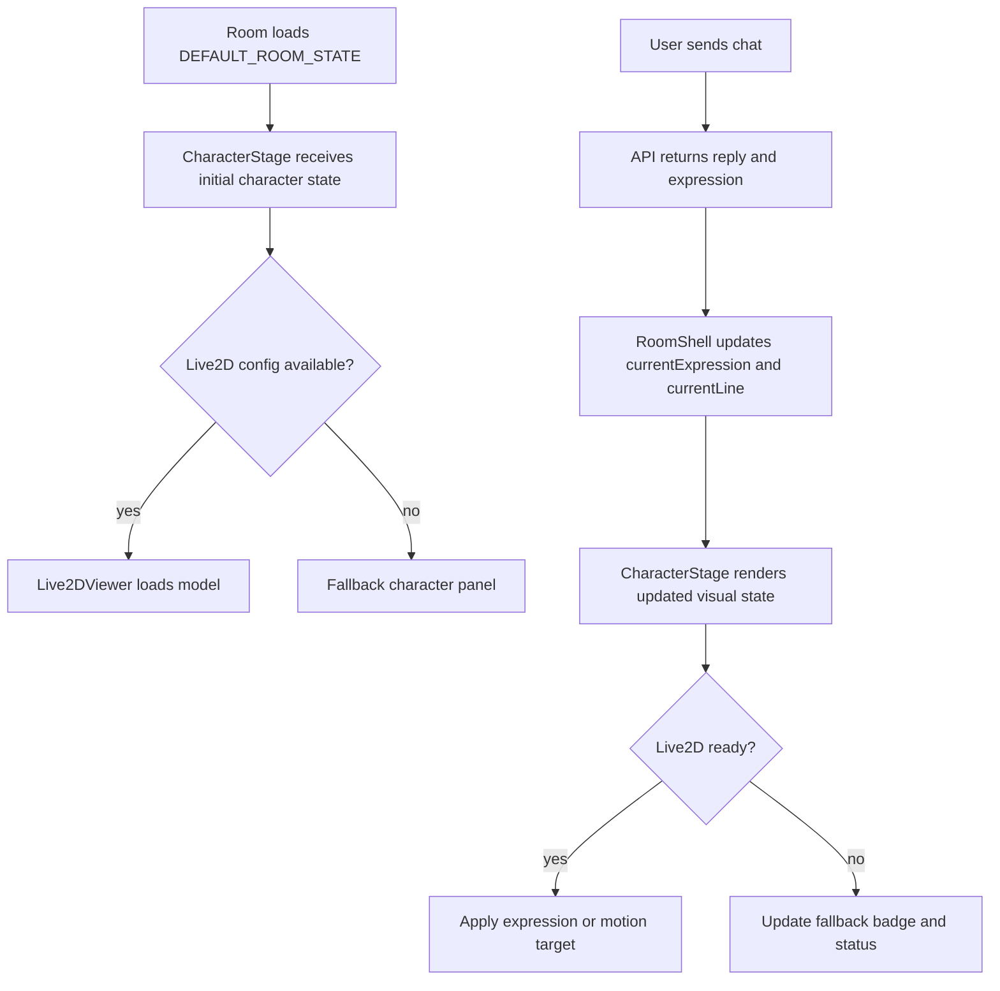

# KumikoRoom Live2D Room Character Design

## Goal

Add a Live2D character presence to the `/room` experience before starting the desktop pet phase.

The first Live2D stage should make the room feel visually inhabited:

- The room shows a dedicated Kumiko character area.
- A local Live2D model can be loaded without committing character media to the repository.
- The existing `neutral`, `listening`, `thinking`, and `encouraging` expression state drives the visible character state.
- The app remains usable when no model is configured or when the model fails to load.
- The state shape stays useful for the later desktop pet phase.

## Current State

The project already has the right data hook for Live2D:

- `apps/web/src/api/types.ts` defines `CharacterState.expression`.
- `apps/web/src/lib/roomState.ts` starts the room in the `listening` expression.
- `apps/web/src/components/RoomShell.tsx` updates `currentExpression` from chat API responses.
- The `/room` page currently focuses on chat and utility panels, with no character visual area.
- `README.md` already requires character images, voice samples, trained voice models, and fan-provided media to stay out of git.

The desktop side is still a thin Electron window that loads the web app. It is useful for showing `/room`, but it is too early for a transparent always-on-top pet window.

## Decision

Stage B should add Live2D inside the web room first. The desktop pet remains a later Stage C task.

Use a wrapper-based Live2D viewer for the first integration, with a narrow abstraction around it. The current ecosystem check on 2026-06-08 shows `pixi-live2d-display@0.4.0` targets Pixi v6 peer packages, while current Pixi releases are much newer. The implementation should pin compatible packages if that wrapper is chosen.

The design should keep a small `Live2DViewer` boundary so a later implementation can switch to the official Cubism SDK for Web without rewriting the room shell.

References:

- Live2D Cubism SDK for Web manual: https://docs.live2d.com/en/cubism-sdk-manual/cubism-sdk-for-web/
- Live2D model loading notes for Web: https://docs.live2d.com/4.2/en/cubism-sdk-manual/model-web/
- `pixi-live2d-display` npm package: https://www.npmjs.com/package/pixi-live2d-display

## Asset Policy

Tracked source files may include:

- Documentation for expected local model layout.
- Type definitions for model configuration.
- Fallback UI for missing models.
- Tests with mocked viewer behavior.

Tracked source files must not include:

- Character model files.
- Texture files.
- Voice samples.
- Trained voice models.
- Fan-provided image packs.

Local assets should live under the ignored `user-data/` directory.

Recommended local structure:

```text
user-data/
  characters/
    kumiko/
      character.json
      live2d/
        model.model3.json
        textures/
        motions/
        expressions/
```

`character.json` can point at the Live2D model:

```json
{
  "displayName": "黄前久美子",
  "live2d": {
    "modelUrl": "/api/local-assets/characters/kumiko/live2d/model.model3.json",
    "expressionMap": {
      "neutral": { "expression": "neutral" },
      "listening": { "motionGroup": "idle" },
      "thinking": { "expression": "thinking" },
      "encouraging": { "expression": "smile" }
    }
  }
}
```

The exact `expressionMap` values are model-dependent. Missing entries should fall back to the closest safe visual state, then to the text expression badge already present in the room.

## Architecture

### `CharacterVisualState`

Add a small room-facing visual state shape:

```ts
export interface CharacterVisualState {
  displayName: string;
  romanizedName: string;
  expression: "neutral" | "listening" | "thinking" | "encouraging";
  statusText: string;
  currentLine: string | null;
  live2d?: Live2DCharacterConfig;
}
```

This can be derived from the existing `RoomState.character` plus the latest Kumiko chat line. The future desktop pet can consume the same shape.

### `Live2DCharacterConfig`

Add a typed config shape for model loading:

```ts
export interface Live2DCharacterConfig {
  modelUrl: string;
  expressionMap: Partial<Record<CharacterVisualState["expression"], Live2DExpressionTarget>>;
}

export interface Live2DExpressionTarget {
  expression?: string;
  motionGroup?: string;
  motionIndex?: number;
}
```

The first implementation can source this config from a local API endpoint or a static development fallback. The design should avoid hard-coding model-specific expression names in `RoomShell`.

### `CharacterStage`

Create a web component that owns the room character area:

- Receives `CharacterVisualState`.
- Shows Live2D when config and runtime are available.
- Shows a calm fallback panel when no model is configured.
- Shows model load errors without breaking chat.
- Keeps the current expression badge and status text visible.

This component gives the layout a stable place for future static art, Live2D, or other character renderers.

### `Live2DViewer`

Create a client-only component that owns the runtime integration:

- Dynamically imports the Live2D runtime package on the client.
- Creates and sizes the Canvas.
- Loads `modelUrl`.
- Applies expression or motion targets when `expression` changes.
- Cleans up app, ticker, textures, event listeners, and Canvas references on unmount.
- Emits load state back to `CharacterStage`: `idle`, `loading`, `ready`, `failed`.

`Live2DViewer` should remain thin. Room layout, user-facing text, and fallback handling belong in `CharacterStage`.

## Room Layout

Change `/room` from a two-column chat-plus-sidebar layout to a three-zone desktop layout:

- Left: `CharacterStage`.
- Center: chat timeline and composer.
- Right: summary, local music, and AI settings.

Responsive behavior:

- Desktop keeps the character visible in the first viewport.
- Medium screens stack character above chat or use a two-row layout.
- Small screens show character as a compact panel above the chat timeline.
- The chat composer must remain reachable without layout jumps.

The visual style should reuse the current Warm Rose Fog palette and 8px card radius.

## Data Flow



## Error Handling

Live2D loading must fail softly:

- Missing model config: show fallback panel with display name, expression label, and status text.
- Model URL returns 404: show a short local-asset setup message.
- Runtime import fails: show fallback panel and keep chat fully usable.
- Expression target missing: keep current model pose and update the badge.
- Motion or expression playback throws: log a bounded diagnostic in development and keep the viewer mounted when possible.
- WebGL unavailable: show fallback panel.

No error should block text chat.

## Testing

Use focused tests before implementation:

- `CharacterStage.test.tsx`
  - Renders fallback when no Live2D config exists.
  - Passes visual state into `Live2DViewer` when config exists.
  - Updates visible expression label when expression changes.
  - Shows load failure copy without hiding chat-facing state.
- `live2dConfig.test.ts`
  - Parses valid local config.
  - Rejects unsafe model URLs.
  - Handles missing expression map entries.
- `RoomShell.test.tsx`
  - Keeps chat behavior unchanged.
  - Updates `CharacterStage` after chat API returns a new expression.
  - Keeps composer reachable with the new layout.

Manual verification:

```powershell
npm run test --workspace apps/web
npm run dev:web
```

Then open `/room` with:

- no local model configured;
- a valid local model configured;
- an invalid model URL;
- several chat replies that change expression.

## Desktop Pet Handoff

Stage C should reuse the visual state from Stage B:

- expression;
- current line;
- model configuration;
- music status;
- unread or reminder state.

Stage C will add Electron-specific behavior:

- transparent frameless window;
- always-on-top setting;
- drag behavior;
- screen-edge positioning;
- tray or menu controls;
- opening the main room from the pet;
- lifecycle cleanup.

Stage B should only prepare state boundaries. It should not implement pet window behavior.

## Acceptance Criteria

Stage B is complete when:

- `/room` has a stable character visual area.
- The app can render a Live2D model from a local, git-ignored model path.
- The app degrades gracefully when the model is absent or broken.
- Chat continues to work with the existing API request and response flow.
- API-returned expression values update the character visual state.
- The implementation has unit tests for fallback, config, and expression updates.
- Documentation explains where local model files belong.
- No character media is committed.

## Open Decisions

- Final runtime package: wrapper-based Pixi integration for speed, or official SDK integration for lower-level control.
- Exact local asset serving route.
- Whether `character.json` should be loaded by the API, the web app, or Electron in desktop mode.
- Exact model-specific expression names once the first local model is available.
- Whether Stage B should support static expression images as an emergency fallback alongside Live2D.
